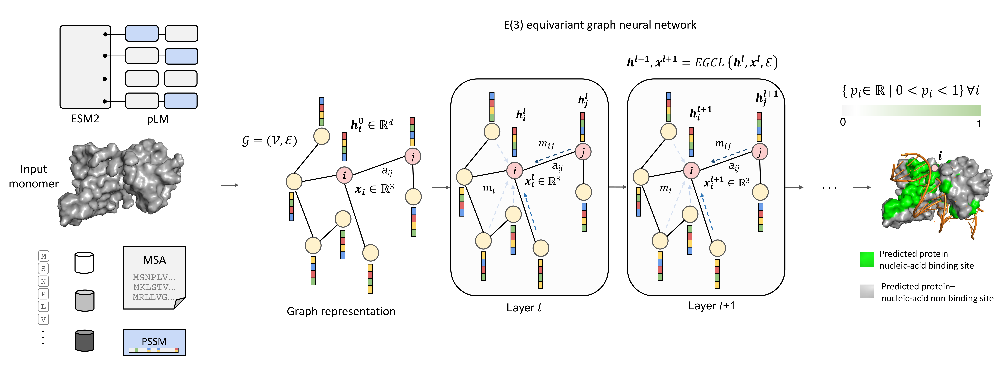

## EquiPNAS: improved protein-nucleic acid binding site prediction using protein-language-model-informed equivariant deep graph neural networks

by Rahmatullah Roche, Bernard Moussad, Md Hossain Shuvo, Sumit Tarafder, and Debswapna Bhattacharya

[[bioRxiv](https://www.biorxiv.org/content/10.1101/2023.09.14.557719v1)] [[pdf](https://www.biorxiv.org/content/10.1101/2023.09.14.557719v1.full.pdf)]

Codebase for our improved protein-nucleic binding site prediction appraoch, EquiPNAS.



## Installation

1.) We recommend conda virtual environment to install dependencies for EquiPNAS. The following command will create a virtual environment named 'EquiPNAS'

`conda env create -f EquiPNAS_env.yml`

2.) Then activate the virtual environment

`conda activate EquiPNAS`

3.) Download the trained models from [here](https://zenodo.org/record/7888985#.ZFHIVHbMK3A)

- For protein-DNA binding site prediction, use models/EquiPNAS-DNA model 
- For protein-RNA binding site prediction, use models/EquiPNAS-RNA model 


That's it! EquiPNAS is ready to be used.

## Usage

To see usage instructions, run `python EquiPNAS.py -h`

```
usage: EquiPNAS.py [-h] [--model_state_dict MODEL_STATE_DICT] [--indir INDIR] [--outdir OUTDIR] [--num_workers NUM_WORKERS]

options:
  -h, --help            show this help message and exit
  --model_state_dict MODEL_STATE_DICT
                        Saved model
  --indir INDIR         Path to input data containing distance maps and input features (default 'datasets/DNA_test_129_Preprocessing_using_AlphaFold2/')
  --outdir OUTDIR       Prediction output directory
  --num_workers NUM_WORKERS
                        Number of workers (default=4)

```
Here is an example of running EquiPNAS:

1.) Input target list and all input files should be inside input preprocessing directory (examples can be found here `Preprocessing/`). A detailed preprocessing instructions can be found [here](Preprocessing/)

2.) Make an output directory `mkdir output`

3.) Run `python EquiPNAS.py --model_state_dict models/EquiPNAS-DNA/E-l12-768.pt --indir Preprocessing/ --outdir output/`

4.) The residue-level protein-DNA or protein-RNA binding site predictions are generated at `output/`. 


## Training 

For protein-DNA binding site prediction, we obtain the training targets from [here](https://github.com/biomed-AI/GraphSite/blob/master/Dataset/DNA_Train_573.fa), and for protein-RNA binding site prediction, we obtain the training targets from [here](http://www.csbio.sjtu.edu.cn/bioinf/GraphBind/datasets.html). Our full train dataset containing the train code, list, and features for both protein-DNA and protein-RNA combined altogether can be found [here](https://zenodo.org/records/10120954). The procedure for training is detailed as follows:

### Train scripts

- Download the train scripts from [here](https://zenodo.org/records/10403691)
- Extract the train scripts and move them to the current directory
  
  `tar -xzvf train_scripts.tar.gz`

  `mv train_scripts/* .`


### Train model for protein-DNA binding site

To train protein-DNA binding site predictions in your own dataset, input train target list and all input files should be inside the train data directory and can be preprocessed as described earlier [here](Preprocessing/). Example train data for protein-DNA binding site prediction can be found [here](https://zenodo.org/records/10413854).

To retrain the protein-DNA binding site prediction model with our dataset, download the train features and data from [here](https://zenodo.org/records/10413854).

- Extract the train features
  
  `tar -xzvf DNA_train_data.tar.gz`
  
- Run the train scripts:

  `python train_model.py --indir DNA_train_data/ --save_dir model/DNA/`

The trained model will be saved inside: `model/DNA`

### Train model for protein-RNA binding site

To train protein-RNA binding site predictions in your own dataset, input train target list and all input files should be inside the train data directory and can be preprocessed as described earlier [here](Preprocessing/) Example train data for protein-RNA binding site prediction can be found [here](https://zenodo.org/records/10414261).

To retrain the protein-RNA binding site prediction model with our dataset, download the train features and data from [here](https://zenodo.org/records/10414261).

- Extract the train features

  `tar -xzvf RNA_train_data.tar.gz`

- Run the train scripts:

  `python train_model.py --indir RNA_train_data/ --save_dir model/RNA`

The trained model will be saved inside: `model/RNA/`

## Test set benchmarking

For protein-DNA binding site prediction, we obtain the test targets for `Test_129` from [here](https://github.com/biomed-AI/GraphSite/blob/master/Dataset/DNA_Test_129.fa), and for `Test_181` from [here](https://github.com/biomed-AI/GraphSite/blob/master/Dataset/DNA_Test_181.fa) For protein-RNA binding site prediction, we obtain the test targets from [here](http://www.csbio.sjtu.edu.cn/bioinf/GraphBind/datasets.html). Our full test dataset containing the test list and features for all the benchmarking datasets can be found [here](https://zenodo.org/record/7897020#.ZFQYbnbMK3A). The procedure for test set benchmarking is detailed as follows:

### Pretrained model

- First download the trained models from [here](https://zenodo.org/record/7888985#.ZFHIVHbMK3A)
- Extract the models

  `tar -xzvf models.tar.gz`

### Protein-DNA

  #### Test_129

  ##### Prediction using AlphaFold2 predicted structural models 

  - Download the test list, data, and features from [here](https://zenodo.org/records/10407858)

  - Extract the features

        tar -xzvf DNA_test_129_Preprocessing_using_AlphaFold2.tar.gz

  - Create output prediction directory

        mkdir outputs/DNA_test_129_predictions_using_AlphaFold2/

  - Run EquiPNAS prediction using the pretrained protein-DNA model

         python EquiPNAS.py --model_state_dict models/EquiPNAS-DNA/E-l12-768.pt --indir DNA_test_129_Preprocessing_using_AlphaFold2/ --outdir outputs/DNA_test_129_predictions_using_AlphaFold2/

  ##### Prediction using experimental structures

  - Download the test list, data, and features from [here](https://zenodo.org/records/10407897)

  - Extract the features

        tar -xzvf DNA_test_129_Preprocessing_using_native.tar.gz

  - Create output prediction directory

        mkdir outputs/DNA_test_129_predictions_using_native/

  - Run EquiPNAS prediction using the pretrained protein-DNA model

         python EquiPNAS.py --model_state_dict models/EquiPNAS-DNA/E-l12-768.pt --indir DNA_test_129_Preprocessing_using_native/ --outdir outputs/DNA_test_129_predictions_using_native/


  #### Test_181

  ##### Prediction using AlphaFold2 predicted structural models

  - Download the test list, data, and features from [here](https://zenodo.org/records/10413105)

  - Extract the features

        tar -xzvf DNA_test_181_Preprocessing_using_AlphaFold2.tar.gz

  - Create output prediction directory

        mkdir outputs/DNA_test_181_predictions_using_AlphaFold2/

  - Run EquiPNAS prediction using the pretrained protein-DNA model

         python EquiPNAS.py --model_state_dict models/EquiPNAS-DNA/E-l12-768.pt --indir DNA_test_181_Preprocessing_using_AlphaFold2/ --outdir outputs/DNA_test_181_predictions_using_AlphaFold2/

  ##### Prediction using experimental structures

  - Download the test list, data, and features from [here](https://zenodo.org/records/10413134)

  - Extract the features

        tar -xzvf DNA_test_181_Preprocessing_using_native.tar.gz

  - Create output prediction directory

        mkdir outputs/DNA_test_181_predictions_using_native/

  - Run EquiPNAS prediction using the pretrained protein-DNA model

         python EquiPNAS.py --model_state_dict models/EquiPNAS-DNA/E-l12-768.pt --indir DNA_test_181_Preprocessing_using_native/ --outdir outputs/DNA_test_181_predictions_using_native/


### Protein-RNA

  #### Test_117

  ##### Prediction using AlphaFold2 predicted structural models

  - Download the test list, data, and features from [here](https://zenodo.org/records/10414557)

  - Extract the features

        tar -xzvf RNA_test_117_Preprocessing_using_AlphaFold2.tar.gz

  - Create output prediction directory

        mkdir outputs/RNA_test_117_predictions_using_AlphaFold2/

  - Run EquiPNAS prediction using the pretrained protein-RNA model

         python EquiPNAS.py --model_state_dict models/EquiPNAS-RNA/E-l12-768.pt --indir RNA_test_117_Preprocessing_using_AlphaFold2/ --outdir outputs/RNA_test_117_predictions_using_AlphaFold2/

  ##### Prediction using experimental structures

  - Download the test list, data, and features from [here](https://zenodo.org/records/10414586)

  - Extract the features

        tar -xzvf RNA_test_117_Preprocessing_using_native.tar.gz

  - Create output prediction directory

        mkdir outputs/RNA_test_117_predictions_using_native/

  - Run EquiPNAS prediction using the pretrained protein-RNA model

         python EquiPNAS.py --model_state_dict models/EquiPNAS-RNA/E-l12-768.pt --indir RNA_test_117_Preprocessing_using_native/ --outdir outputs/RNA_test_117_predictions_using_native/

