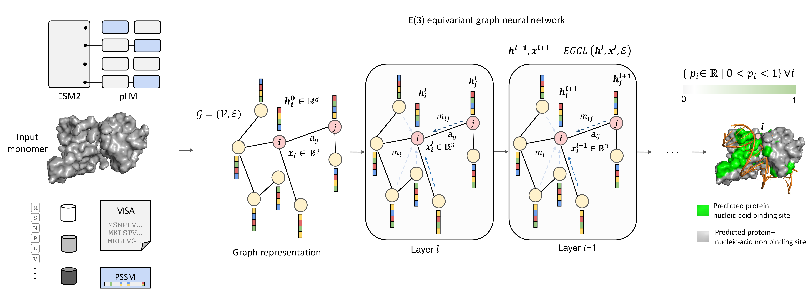

# EquiPNAS: Improved Protein-nucleic Acid Binding Site Prediction Using Pretrained Protein Language Model and Equivariant Deep Graph Learning

by Rahmatullah Roche, Bernard Moussad, Md Hossain Shuvo, Sumit Tarafder, and Debswapna Bhattacharya

[[bioRxiv](https://www.biorxiv.org/content/...)] [[pdf](https://www.biorxiv.org/content/....full.pdf)]

Codebase for our improved protein-nucleic binding site prediction appraoch, EquiPNAS.



## Installation

1.) We recommend conda virtual environment to install dependencies for EquiPNAS. The following command will create a virtual environment named 'EquiPNAS'

`conda env create -f EquiPNAS_environment.yml`

2.) Then activate the virtual environment

`conda activate EquiPNAS`

3.) Download the trained models from [here](https://zenodo.org/record/7888985#.ZFHIVHbMK3A)

- For protein-DNA binding site prediction, use models/EquiPNAS-DNA model 
- For protein-RNA binding site prediction, use models/EquiPNAS-RNA model 


That's it! EquiPNAS is ready to be used.

## Usage

To see usage instructions, run `python EquiPNAS.py -h`

```
usage: EquiPNAS.py [-h] [--model_state_dict MODEL_STATE_DICT] [--indir INDIR] [--outdir OUTDIR] [--num_workers NUM_WORKERS]

options:
  -h, --help            show this help message and exit
  --model_state_dict MODEL_STATE_DICT
                        Saved model
  --indir INDIR         Path to input data containing distance maps and input features (default 'datasets/DNA_test_129_Preprocessing_using_AlphaFold2/')
  --outdir OUTDIR       Prediction output directory
  --num_workers NUM_WORKERS
                        Number of workers (default=4)

```
Here is an example of running EquiPNAS:

1.) Input target list and all input files should be inside input preprocessing directory (examples can be found here `Preprocessing/`). A detailed preprocessing instructions can be found [here](Preprocessing/)

2.) Make an output directory `mkdir output`

3.) Run `python EquiPNAS.py --model_state_dict models/EquiPNAS-DNA/E-l12-768.pt --indir Preprocessing/ --outdir output/`

4.) The residue-level PPI site predictions are generated at `output/`. 


## Datasets

All the benchmarking datasets can be found [here]()
 
